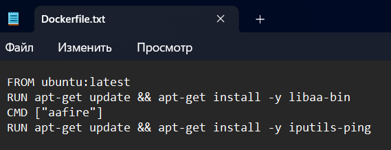
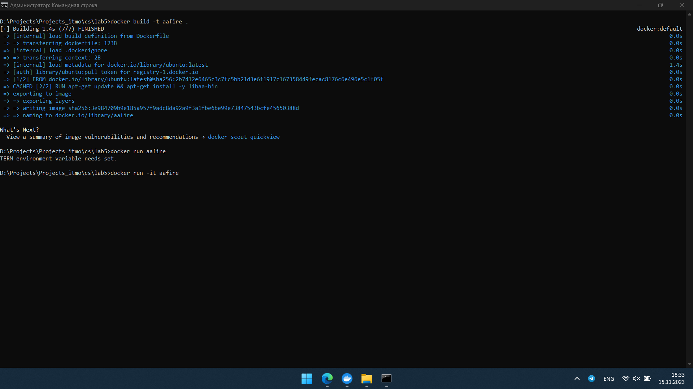
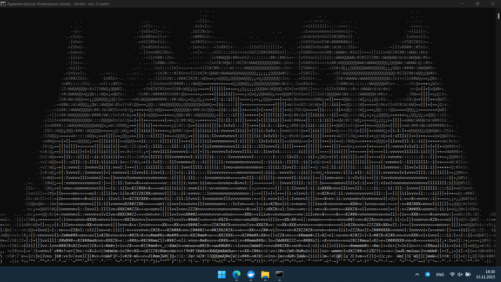
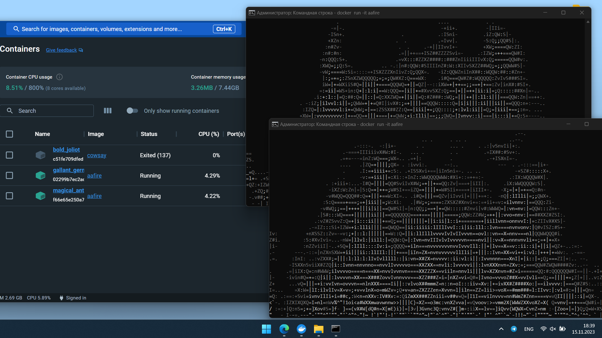
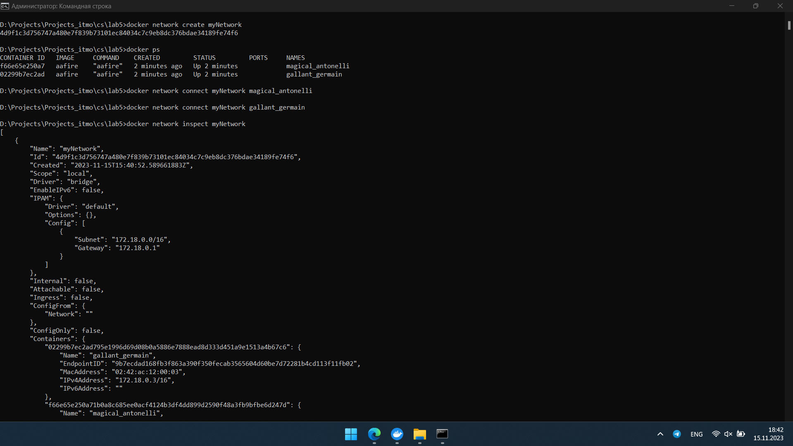
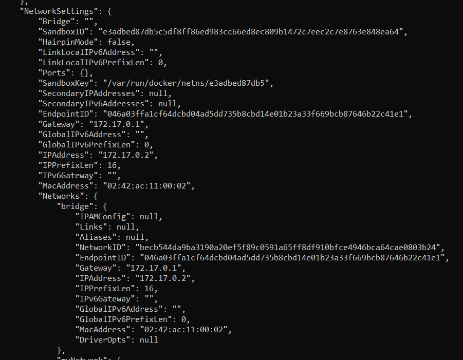
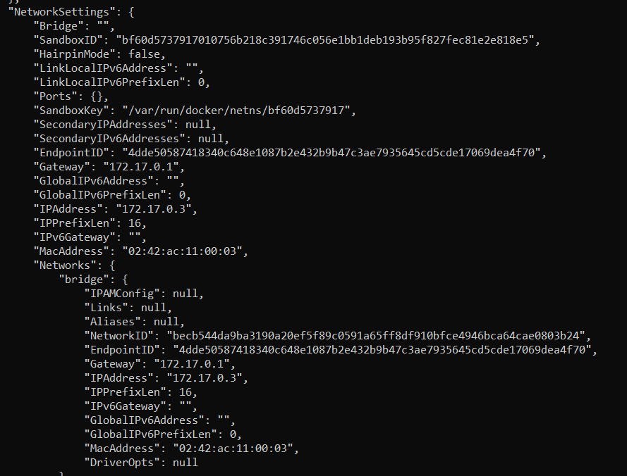
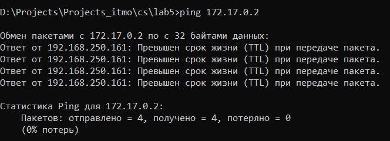
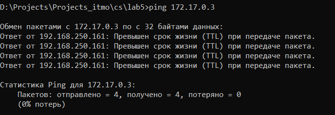

# Lab4
В начале я написал Dockerfile: \
 \
После этого создал Docker image: \
 \
И наконец, запустил контейнер с aafire: \
 \
Далее запустил два контейнера с aafire: \
 \
Создал сеть с помощью команды `docker network create myNetwork` \ 
добавил оба котейнера командами `docker network connect myNetwork magical_antonelli`, `docker network connect myNetwork gallant_germain` \
и посмотрел настройки сети (`docker network inspect myNetwork`): \
 \
Далее узнал IP-адреса контейнеров (`docker inspect container_name`): \
 \
 \
И проверил соединение командой `ping`: \
 \

